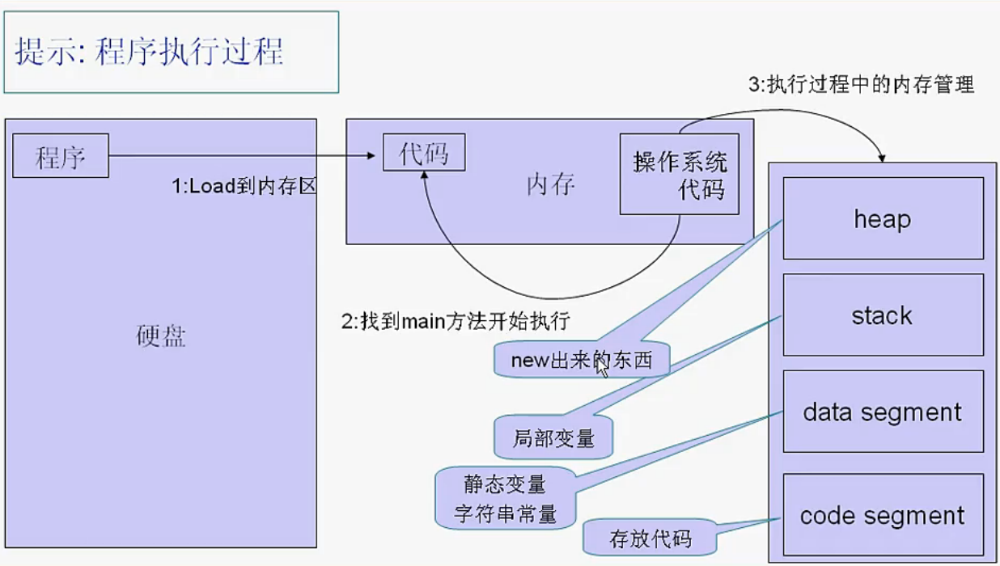

# 语法篇


## 位运算

### 位运算交换变量技巧

```java
int a = 1;
int b = 2;
a = a ^ b;
b = a ^ b;
a = a ^ b;
// 结果输出：a = 2;b = 1;
```


## 内存图




## 变量作用域

变量只在当前大括号范围内使用，例如if {}这类判断也是单独的作用域。

## 数据类型


### boolean类型注意

布尔类型只能为true或者false，不能用0或非0来表示，例如：

```java
int a = 1;
if (a) {
    System.out.println(a);
}
```

这样的写法就是错的，条件判断里面，只支持boolean类型值，例如：

```java
int a = 1;
if (a > 0) {
    System.out.println(a);
}
```


### 整数类型

long类型必须加L后缀，不然错误。


### 浮点类型

float类型必须加f后缀，不然出错。


## 不同进制算法

### 二进制与十进制

找数字为1的位，乘以2的N次方之和。

1 2 4 8 16 32 64

100110 = 2 + 4 + 32 = 38

相反：

56 = 32 + 16 + 8 = 111000

### 十六进制与2进制

没一位转为10进制，再转为2进制。16进制每一位用4位二进制表示。

FE60 = 15 14 6 0 = 1111 1110 0110 0000

反之

1101 0011 1101 0001 = 13 3 13 1 = D3D1


## 对象比较

对象之间，不能直接用 `==` 来比较，必须用对象的equals方法来比较。例如：

```java
Integer a = new Integer(1);
Integer b = new Integer(1);
System.out.println(a == b); // false
System.out.println(a.equals(b)); // true
System.out.println(a.equals(1)); // true
```


## `break`跳出多层

给循环命名，例如：

```java
a:for (int a = 0;a < 10;a++) {
  for (int b = 0;b < 10;b++) {
    break a;
  }
}
```


## `switch`支持的类型

|    版本     |                    类型                    |
| :-------: | :--------------------------------------: |
| 1.0 ~ 1.4 |       `byte` `short` `int` `char`        |
| 1.5 ~ 1.6 |    `byte` `short` `int` `char` `enum`    |
|    1.7    | `byte` `short` `int` `char` `enum` `String` |

