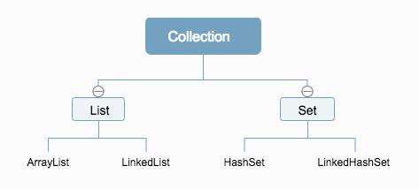

# 集合框架


## 关系图



`list`接口特点：有序，有索引，可以重复元素。

`Set`接口特性：无序，无索引，不能重复元素。


## `Iterator` 迭代器

用于不同容器 ( List  Set等不同分支的实现类)，取出元素，即集合遍历。

示例：

```java
for (Iterator<Post> it = al.iterator(); it.hasNext();) {
    Post post = (Post) it.next();
    // post为Post实例
}
```


## foreach

上面例子可以简写为foreach语法：

```java
for (Post post : al) {
    // post为Post实例
}
```


## `ArrayList` 存储任意类型对象

指定类型为顶层对象，即可存储任意类型对象。

```java
ArrayList<Object> al2 = new ArrayList<Object>();
al2.add(123);
al2.add("abc");
al2.add(new Post("a", 1));
```


## 泛型

java泛型是“伪泛型”，只是编译时用于类型安全验证，编译之后的class文件没有泛型。

带有泛型的类：

```java
// 声明类
public class Fan<E> {
	public void testE(E e) {
		System.out.println(e);
	}
}

// 使用类
Fan<String> fan = new Fan<String>();
fan.testE("abc");
```

详情例子可以参考`Arraylist`类。

### 泛型的通配符 `?`

 ```java
public static void testF(ArrayList<?> al) {
    for (Object object : al) {
        System.out.println(object);
    }
}
 ```

### 泛型的限制

上限限制，可以传递本类或者子类对象

```java
public static void testF(ArrayList<? extends Post> al) {
    for (Post post : al) {
        post.send();
    }
}
```

下限限制，可以传递本类或者父类对象,不安全

```java
public static void testF(ArrayList<? super Zi> al) {
    for (Object obj : al) {
        obj.toString();
    }
}
```


## 并发修改异常

在遍历集合的同时，修改了集合的长度（add,remove）时，会造成并发修改异常(ConcurrentModificationException)。

例：

```java
for (Integer i : alInt) {
    if (i == 1) {
        alInt.add(3, 123);
    }
}
```


## 数据存储结构

1.  堆栈

    先进后出，出入都在顶端。

2.  队列

    先进先出，出入口在两侧。

3.  数组 `ArrayList`

    有索引，查找速度快，增删慢。

4.  链表 `LinkedList`

    查找慢，增删快。

